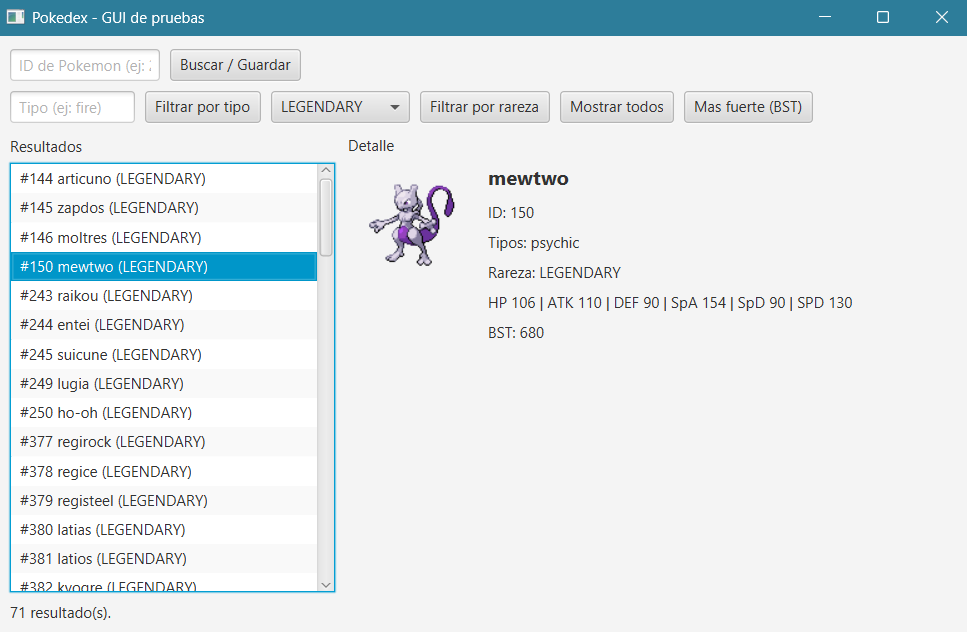
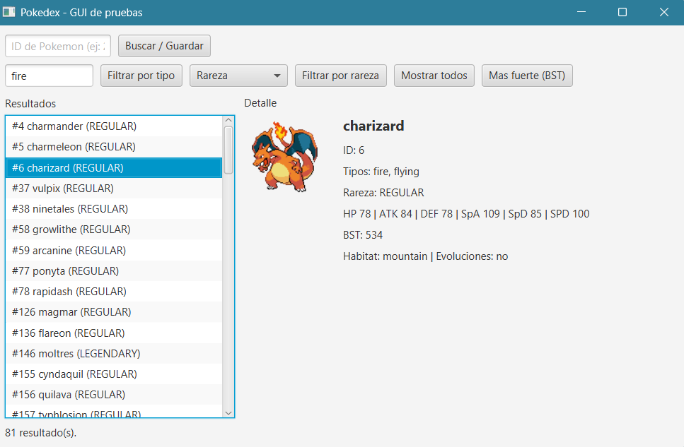
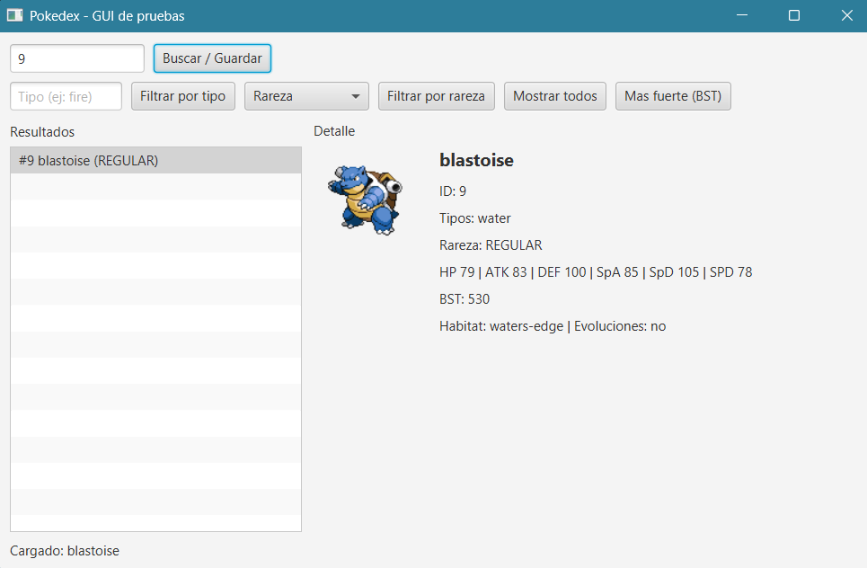

# Java Pokedex Backend

A modular Java backend that consumes PokeAPI. This project applies object-oriented design patterns, layered architecture, and a local-first cache-aside persistence strategy with SQLite.

## Technologies

- Java
- SQLite
- JDBC
- Jackson
- PokeAPI
- Java HttpClient

## Project Structure

```text
com.jorgeruiz.pokedex/
├── api/          # Native HTTP client and JSON mapping
├── gui/          # Testing graphical user interface
├── model/        # Polymorphic domain entities (Regular, Legendary and Mythical)
├── repository/   # SQLite persistence with JDBC
└── service/      # Business logic and local-first strategy
```

## Database Model

- **pokemon**: stores base attributes, stats and specific subclass data (habitat, has_evo, rarity)
- **type**: stores unique type names
- **pokemon_type**: junction table implementing the many-to-many relationship between pokemon and types

## Key Concepts

- Object-oriented design and polymorphism
- Layered architecture
- Repository pattern
- Cache-aside / local-first persistence
- REST API consumption
- JSON serialization and deserialization
- JDBC and SQLite
- Many-to-many database relationships

## Screenshots




